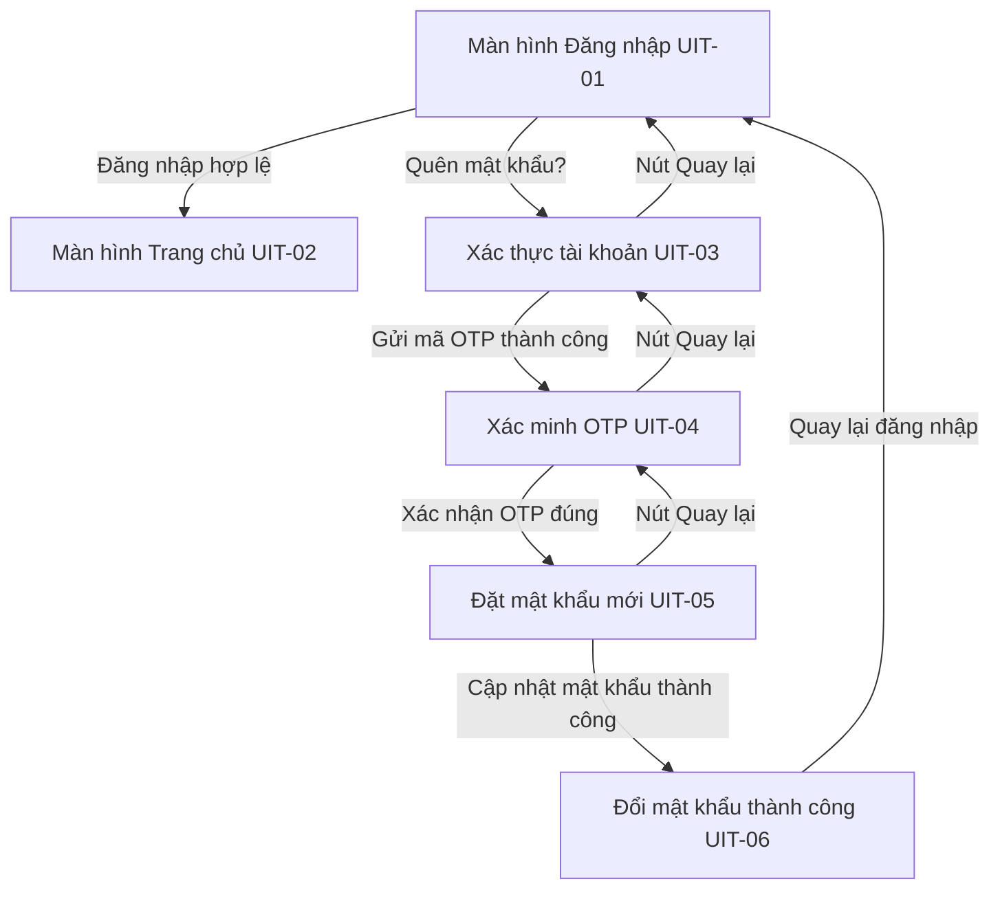

# Design — Banking Authentication & Password Recovery Flow v1

- **Brief:** [brief.md](brief.md)
- **Brief approval reference/revision:** Gate 1 approved by user in interaction: "(Recommended) Đồng ý phê duyệt Gate 1 (Requirements Brief) — Tiến hành Gate 2: Thiết kế chi tiết & Bảng linh kiện (Design & Component Matrix)"
- **Status:** APPROVED_DESIGN
- **Approval reference:** Gate 2 approved by user in interaction: "(Recommended) Đồng ý phê duyệt Gate 2 (Design & Component Matrix) — Tiến hành lập Kế hoạch thực hiện chi tiết (Gate 3: Implementation Plan)"

---

## Options and decision

### Architectural Options

#### Option A (Recommended) — Layered Clean Architecture with BLoC & Modular DI
- **Structure**:
  - `lib/core/`: Centralized design system tokens (`AppColors`, `AppTypography`, `AppSpacing`, `AppRadius`, `AppShadows`), theme data, DI container (`AppDiConfig`), route definitions, and base BLoC classes (`BaseBlocState`).
  - `lib/commons/`: Standardized, enterprise-grade reusable UI Kit widgets mirroring `flutter_ui_kit` (`AppPrimaryButton`, `AppSecondaryButton`, `AppTextField`, `AppCheckbox`, `BalanceGradientCard`, `SecurityBadge`, `NoticeBannerBox`).
  - `lib/modules/auth/`: Pure 3-layer Clean Architecture:
    - `domain/`: Pure Dart entities (`UserEntity`, `AuthTokenEntity`), repository contracts (`AuthRepository`), and use cases (`LoginUseCase`, `VerifyAccountUseCase`, `VerifyOtpUseCase`, `ResetPasswordUseCase`).
    - `data/`: DTO models, local/remote data sources (`AuthLocalDataSource`, `AuthMockApiDataSource`), and repository implementation (`AuthRepositoryImpl`).
    - `presentation/`: BLoCs/Cubits (`LoginCubit`, `AccountVerificationCubit`, `OtpVerificationCubit`, `NewPasswordCubit`), screen pages (UIT-01, UIT-03, UIT-04, UIT-05, UIT-06), and screen-specific sub-widgets.
  - `lib/modules/home/`: Presentation layer for UIT-02 (`HomeScreen`, `HomeCubit`, quick action cards, transaction feed).
- **Pros**: Clear separation of concerns, testable business logic without Flutter widget tree dependencies, 100% adherence to Coder Nexus blueprints, easily extendable to real APIs in future versions.
- **Cons**: Requires standard initial boilerplate for Clean Architecture layers.

#### Option B — Flat Feature-First with ChangeNotifier / ValueNotifier
- **Structure**: All logic inside widgets or simple Controller classes in `lib/features/`.
- **Pros**: Slightly fewer files initially.
- **Cons**: Violates enterprise Flutter Clean Architecture rules, tightly couples UI to state, hard to unit test use cases independently.

### Decision
- **Chosen Approach**: **Option A (Clean Architecture + BLoC/Cubit + Standard Commons UI Kit)**.

---

## Client boundaries and UI

### Component Discovery Matrix

| Touchpoint / Screen | UI Element Required | Selected Component / Kit Candidate | Category | Source / Import | Customization & Styling Notes |
|---|---|---|---|---|---|
| **UIT-01 (Đăng nhập)** | Input Tên đăng nhập & Mật khẩu | `AppTextField` | `input` | `lib/commons/input/app_text_field.dart` | Floating label, leading user/lock icon, password toggle eye icon, inline errorText. |
| **UIT-01 (Đăng nhập)** | Ghi nhớ tên đăng nhập | `AppCheckbox` | `selection` | `lib/commons/selection/app_checkbox.dart` | Accessible touch target (>= 44px), primary-500 active color. |
| **UIT-01 (Đăng nhập)** | Nút Đăng nhập | `AppPrimaryButton` | `action` | `lib/commons/button/app_primary_button.dart` | Height 48px, radius 12px, trailing arrow, loading spinner support. |
| **UIT-01 (Đăng nhập)** | Nút Đăng nhập Face ID | `AppSecondaryButton` | `action` | `lib/commons/button/app_secondary_button.dart` | Outline style, Face ID leading icon, radius 12px. |
| **UIT-01 (Đăng nhập)** | Trust Badge footer | `SecurityBadge` | `badge` | `lib/commons/badge/security_badge.dart` | Status verified, green pill, text "Bảo mật mã hóa 256-bit SSL & PCI DSS". |
| **UIT-02 (Trang chủ)** | Thẻ số dư chính | `BalanceGradientCard` | `card` | `lib/commons/card/balance_gradient_card.dart` | Deep blue/indigo gradient, masked toggle, copy account number button. |
| **UIT-02 (Trang chủ)** | Nút thao tác nhanh | `QuickActionCard` | `card` | `lib/modules/home/presentation/widgets/quick_action_card.dart` | 3 cards (Chuyển tiền, Hóa đơn, Nạp tiền) with icon + label. |
| **UIT-02 (Trang chủ)** | Danh sách giao dịch | `AppListTile` / `TransactionItemTile` | `list` | `lib/commons/list/app_list_tile.dart` | Leading category icon in 40x40 circle, title, subtitle, amount (+Green/-Grey). |
| **UIT-02 (Trang chủ)** | Bottom Bar (5 tabs) | `BankingBottomNavBar` | `navigation` | `lib/commons/navigation/banking_bottom_nav_bar.dart` | 5 tabs with prominent elevated center QR scanner action button. |
| **UIT-03 (Xác thực TK)** | Input SĐT / Email | `AppTextField` | `input` | `lib/commons/input/app_text_field.dart` | Leading user icon, trailing verified shield check indicator. |
| **UIT-03 (Xác thực TK)** | Thông báo nguyên tắc bảo mật | `NoticeBannerBox` | `feedback` | `lib/commons/feedback/notice_banner_box.dart` | Blue tint background, info icon, warning text on confidentiality. |
| **UIT-03 (Xác thực TK)** | Nút Gửi mã OTP | `AppPrimaryButton` | `action` | `lib/commons/button/app_primary_button.dart` | Height 48px, radius 12px, primary brand blue. |
| **UIT-04 (Xác minh OTP)** | 6 ô nhập mã OTP | `OtpInputGroup` | `input` | `lib/commons/input/otp_input_group.dart` | 6 discrete 48x56px boxes, auto-focus next on digit input, backspace handling. |
| **UIT-04 (Xác minh OTP)** | Đếm ngược & Gửi lại | `OtpTimerResendWidget` | `feedback` | `lib/modules/auth/presentation/widgets/otp_timer_resend_widget.dart` | Live ticker (01:45), orange warning color, active "Gửi lại mã" when expired. |
| **UIT-04 (Xác minh OTP)** | Lưu ý an toàn | `NoticeBannerBox` | `feedback` | `lib/commons/feedback/notice_banner_box.dart` | Yellow/Warning tint, shield warning icon, safe advisory message. |
| **UIT-05 (Đặt mật khẩu)** | Input Mật khẩu mới & Nhập lại | `AppTextField` | `input` | `lib/commons/input/app_text_field.dart` | Lock leading icon, password show/hide suffix, inline mismatch validation. |
| **UIT-05 (Đặt mật khẩu)** | Bảng tiêu chuẩn mật khẩu | `PasswordCriteriaCard` | `card` | `lib/modules/auth/presentation/widgets/password_criteria_card.dart` | 4 real-time rule rows with green check / grey circle indicators. |
| **UIT-06 (Thành công)** | Huy hiệu checkmark lớn | `SuccessCheckmarkBadge` | `badge` | `lib/modules/auth/presentation/widgets/success_checkmark_badge.dart` | 80x80px soft green circle (`Color(0xFFECF8EF)`) with green checkmark icon. |
| **UIT-06 (Thành công)** | Chi tiết cập nhật bảo mật | `SecurityDetailCard` | `card` | `lib/modules/auth/presentation/widgets/security_detail_card.dart` | Container with timestamp, SMS OTP method, previous session note. |
| **UIT-06 (Thành công)** | Nút Quay lại đăng nhập | `AppPrimaryButton` | `action` | `lib/commons/button/app_primary_button.dart` | Giant button navigating back to UIT-01 with reset stack. |

---

### Navigation Lifecycle & Multi-Screen Routing Flow

- **Stack Management Policy**:
  - `UIT-01 -> UIT-03 -> UIT-04 -> UIT-05`: Standard push navigation with left chevron app bar pop support.
  - `UIT-05 -> UIT-06`: Replacement navigation (prevents user from navigating back to password change form after completion).
  - `UIT-06 -> UIT-01`: Clear stack (`pushNamedAndRemoveUntil(UIT-01)`) to ensure security and prevent dirty back-navigation.
  - `UIT-01 -> UIT-02`: Replacement navigation (`pushReplacementNamed(UIT-02)`) upon successful authentication.

---

### BLoC State Management Specifications

#### 1. LoginCubit & State
- **States**:
  - `LoginInitial`: Default empty form.
  - `LoginFormUpdate`: Username, password, rememberMe, isFormValid.
  - `LoginLoading`: Button displays spinner, inputs disabled.
  - `LoginSuccess`: Navigates to Home (`UIT-02`).
  - `LoginFailure`: Inline error message on password field (per `auth_failure` UX pattern; username kept intact).

#### 2. AccountVerificationCubit & State
- **States**:
  - `AccountVerificationInitial`: Empty input.
  - `AccountVerificationUpdate`: Input text, isPhoneOrEmailValid.
  - `AccountVerificationLoading`: Dispatching OTP request.
  - `AccountVerificationSuccess`: Triggers navigation to `UIT-04`.
  - `AccountVerificationFailure`: Inline error ("Không tìm thấy thông tin tài khoản").

#### 3. OtpVerificationCubit & State
- **States**:
  - `OtpVerificationInitial`: 6 empty boxes, timer set to 105 seconds (01:45).
  - `OtpVerificationTick`: Current remaining seconds, formatted string (`mm:ss`).
  - `OtpVerificationUpdate`: Current 6-digit string, isComplete (length == 6).
  - `OtpVerificationLoading`: Verifying OTP code.
  - `OtpVerificationSuccess`: Code verified, navigates to `UIT-05`.
  - `OtpVerificationFailure`: Invalid code error message, OTP input highlighted in error state.
  - `OtpVerificationExpired`: Timer reached 00:00, "Gửi lại mã" enabled.

#### 4. NewPasswordCubit & State
- **States**:
  - `NewPasswordInitial`: Criteria all false, button disabled.
  - `NewPasswordUpdate`:
    - `hasMinLength`: 8-20 characters.
    - `hasUpperLower`: Contains both uppercase and lowercase letters.
    - `hasDigit`: Contains at least one digit (0-9).
    - `hasSpecialChar`: Contains at least one special character (`!@#$%^&*`).
    - `isMatched`: Confirm password matches new password.
    - `isAllValid`: All 4 criteria + match are true.
  - `NewPasswordLoading`: Submitting new password.
  - `NewPasswordSuccess`: Navigates to `UIT-06`.
  - `NewPasswordFailure`: Submission error message.

---

## Failure behavior and verification

### UX Error Patterns & Edge Cases (from MCP get_ux_error_patterns)

1. **Authentication Failure (`auth_failure`)**:
   - Error is rendered directly as inline `errorText` on the password `AppTextField`.
   - Never pop up a blocking modal alert for invalid credentials.
   - Preserves the typed username/account number.
2. **Form Validation (`form_validation`)**:
   - Real-time feedback on input change or focus loss.
   - Primary submit button is disabled (`enabled: false`) until all mandatory fields are valid.
3. **OTP Expiry & Resend**:
   - When countdown hits 0, display warning alert.
   - User tapping "Gửi lại mã" resets countdown timer to 01:45 and resets OTP boxes.
4. **Password Security Feedback**:
   - Real-time checkmark indicator switches from grey circle to green checkmark instantly as the user types characters satisfying each rule.

### Quality & Verification Strategy
- **Static Analysis**: `flutter analyze` runs with 0 errors, 0 warnings.
- **Unit & BLoC Tests**:
  - `test/modules/auth/presentation/cubits/login_cubit_test.dart`
  - `test/modules/auth/presentation/cubits/otp_verification_cubit_test.dart`
  - `test/modules/auth/presentation/cubits/new_password_cubit_test.dart`
- **Widget Tests**:
  - `test/modules/auth/presentation/pages/login_page_test.dart`
  - `test/modules/home/presentation/pages/home_page_test.dart`
  - `test/modules/auth/presentation/pages/account_verification_page_test.dart`
  - `test/modules/auth/presentation/pages/otp_verification_page_test.dart`
  - `test/modules/auth/presentation/pages/new_password_page_test.dart`
  - `test/modules/auth/presentation/pages/reset_password_success_page_test.dart`
